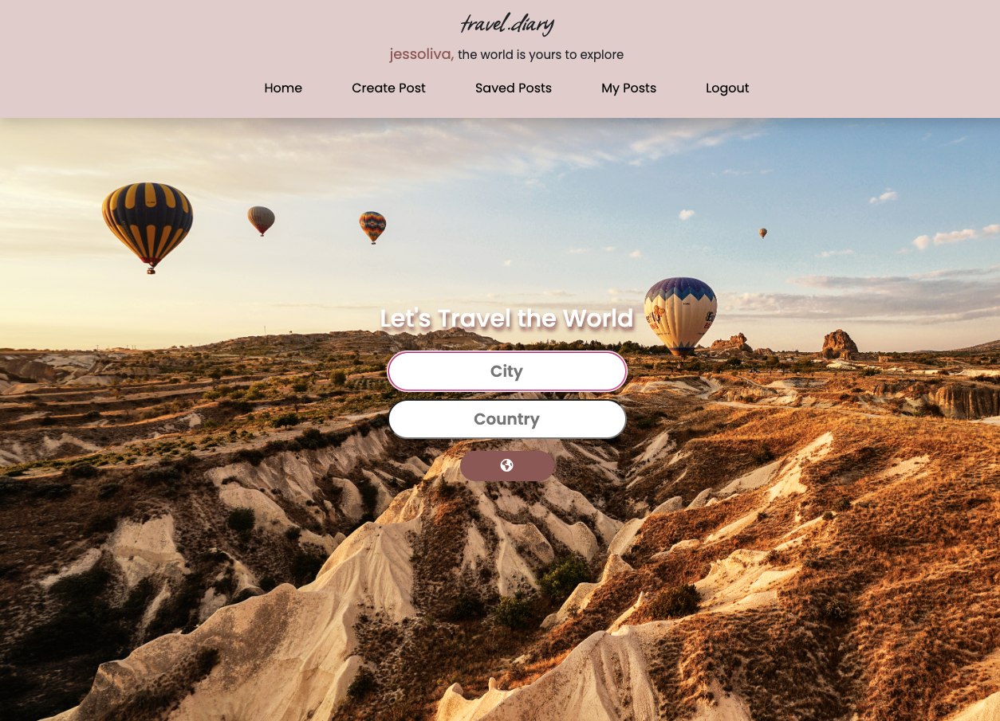
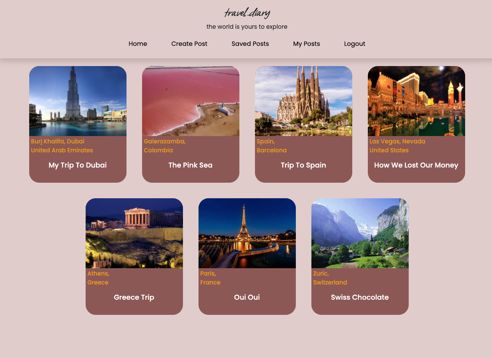
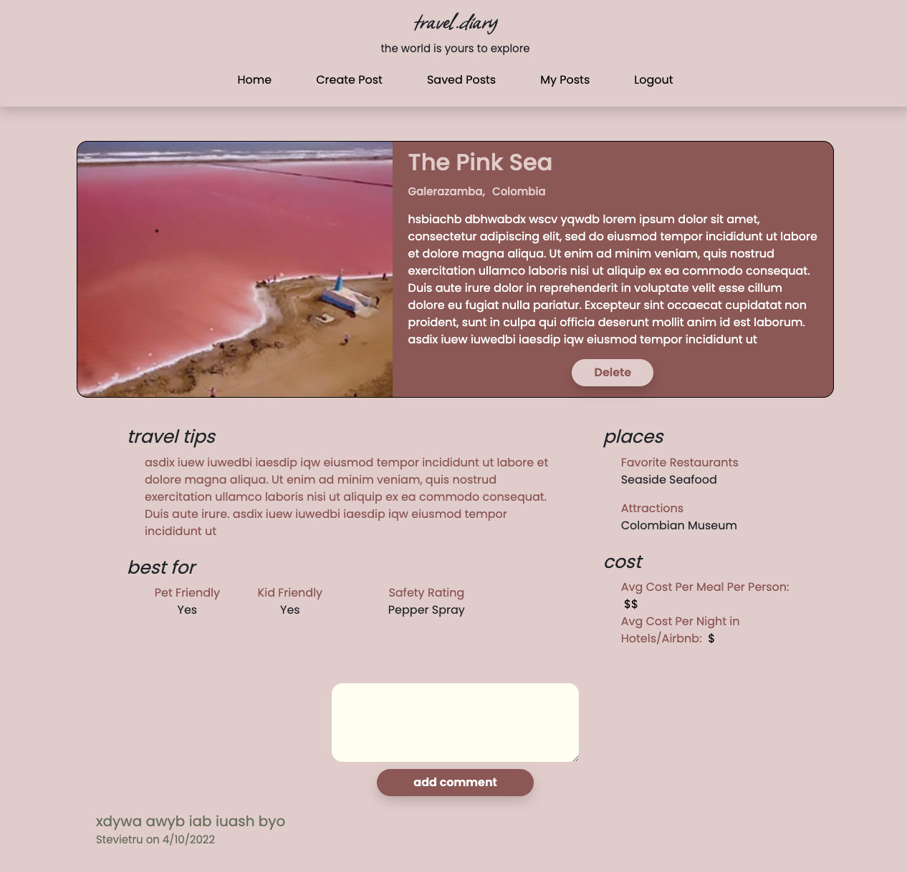
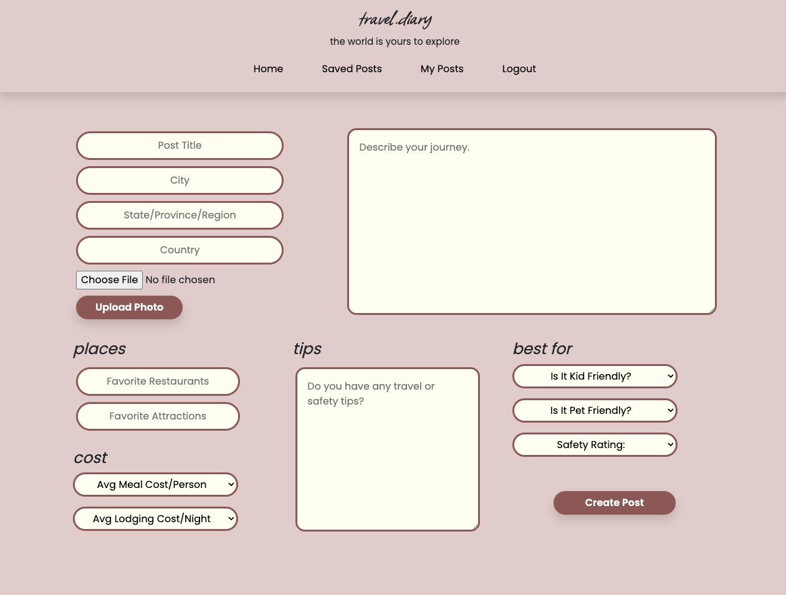

# travel.diary

This app is perfect to for sharing stories, tips, and info about your travel experiences! 😊

## 📚&nbsp; Table of Contents

- [✨&nbsp; Description](#description)
- [🌼&nbsp; Features](#features)
- [🛠️&nbsp; Installation](#installation)
- [👩🏽‍💻&nbsp; Usage](#usage)
- [✏️&nbsp; Contribution Guidelines](#contribution-guidelines)
- [👨‍👩‍👧‍👦&nbsp; Credits](#credits)
- [📱&nbsp; Contact](#contact)
- [📰&nbsp; License](#license)

## ✨&nbsp; Description

Visit and enjoy [travel.diary](https://afternoon-harbor-62644.herokuapp.com/)

&emsp;&emsp;&emsp; 

&emsp;&emsp;&emsp; 

&emsp;&emsp;&emsp; 

&emsp;&emsp;&emsp; 

&emsp;&emsp;&emsp; 

&emsp;&emsp;&emsp; 

&emsp;&emsp;&emsp; 

## 🌼&nbsp; Features

- This application allows users to search for destinations using city and country. 
- After entering a destination, posts from other users will appear. 
- When user picks a post, information about the place will come up. 
- The user will see a post title, journey description, cost for their meal/stay, favorite restaurants/attractions, tips about transportation/travel/safety, if the place is best for kids/pets/family as well as a safety rating. 
- User also has a back or next post button. 
- If user wants to create a post signing up is needed, it'll ask for a name, username, password, and email. 
- If user has an account, User can comment on other posts.

## ✏️&nbsp; Contribution Guidelines

## 👨‍👩‍👧‍👦&nbsp; Credits

- [MDN Web Docs](https://developer.mozilla.org/en-US/)
- [W3Schools - event onchange](https://www.w3schools.com/)
- [Stack Overflow](https://stackoverflow.com/)

## 📰&nbsp; License

    Copyright 2022 Jessica Olivares, Sheroo Bhagia, Stevie Trudell, Edmer Franciz Valencia

Permission is hereby granted, free of charge, to any person obtaining a copy of this software and associated documentation files (the "Software"), to deal in the Software without restriction, including without limitation the rights to use, copy, modify, merge, publish, distribute, sublicense, and/or sell copies of the Software, and to permit persons to whom the Software is furnished to do so, subject to the following conditions:

The above copyright notice and this permission notice shall be included in all copies or substantial portions of the Software.

THE SOFTWARE IS PROVIDED "AS IS", WITHOUT WARRANTY OF ANY KIND, EXPRESS OR IMPLIED, INCLUDING BUT NOT LIMITED TO THE WARRANTIES OF MERCHANTABILITY, FITNESS FOR A PARTICULAR PURPOSE AND NONINFRINGEMENT. IN NO EVENT SHALL THE AUTHORS OR COPYRIGHT HOLDERS BE LIABLE FOR ANY CLAIM, DAMAGES OR OTHER LIABILITY, WHETHER IN AN ACTION OF CONTRACT, TORT OR OTHERWISE, ARISING FROM, OUT OF OR IN CONNECTION WITH THE SOFTWARE OR THE USE OR OTHER DEALINGS IN THE SOFTWARE.